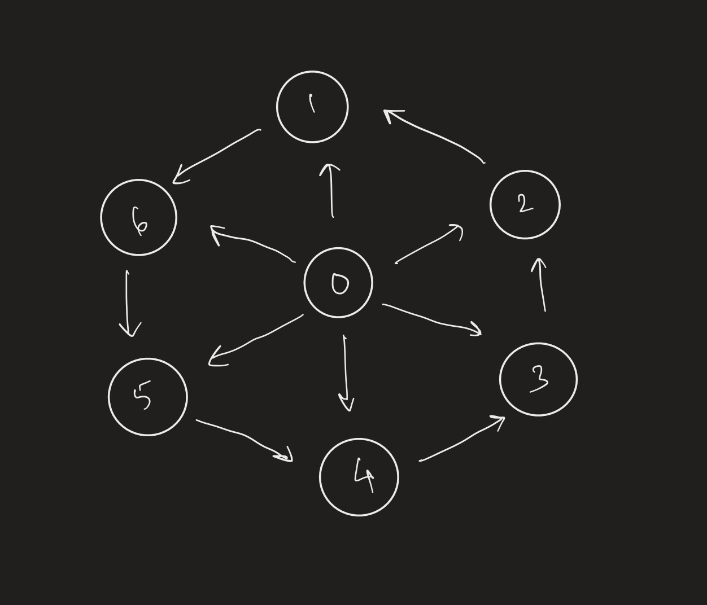
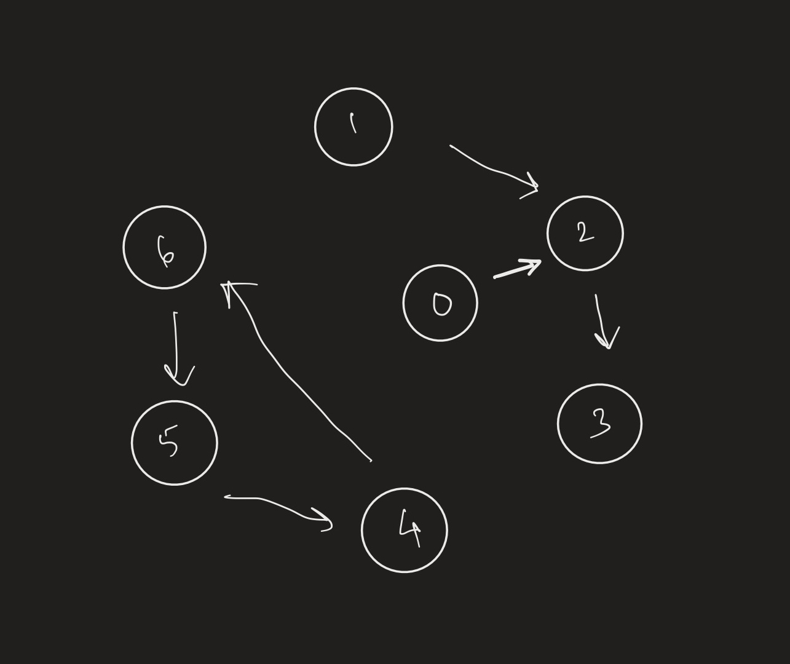

## Goals
- Load a dataset of web graph edges from the Stanford Large Network Dataset Collection (web-Google) into a graph structure
- Perform a complete breadth-first traversal on our graph
- Run the PageRank algorithm on our graph and output a list of pages ordered by likelihood of being visited
- Examine the effects of changing the alpha parameter of the PageRank algorithm

Overall, we accomplished our goals.

## Our deliverables

- Our makefile runs as expected
- We properly read in our Google web graph and built an adjacency list & adjacency matrix based on it
- We have thoroughly tested our graph and algorithms for bugs and memory leaks
- We have completed the BFS & PageRank algorithms
- All outputs are printed to `/output/<name>.txt`

# Algorithms & Traversals

We have decomposed our project into a Graph class, and an algos namespace, where our static functions algorithm functions are located.
Wherever possible, we have observed good programming habits; this may be through git, documentation, etc.

## Graph Class

Our graph class includes structs for vertices and edges and various data structures to store and manipulate data. We build an adjacency list for our BFS algorithm with a space complexity of O(V + E). In addition, we have a list of vertices and a map that connects IDs to their indices, both with O(V) space complexity. Our adjacency matrix was necessary for the PageRank algorithm and has a space complexity of O(V^2).<br><br>

The graph class contains functions for Rule of Three, constructors, and helper functions for accessing member variables. The constructors include a blank default constructor, a copy constructor, and a constructor that reads data from a file in the following format:<br>
|    |  |
| ----------- | ----------- |
| Vertex1      | Vertex2       |
| Vertex1   | Vertex3        |

## BFS

Our BFS traversal starts at a given vertex and, using a queue, travels to each connected vertex while tracking visited vertices. Once it finds all of the vertices in the connected subgraph, it goes through all vertices to identify any components that are disconnected from the starting point's subgraph to completely cover the entire graph. This makes our traversal able to appropriately handle and continue to work in a disconnected graph. This algorithm is able to run on our entire dataset, though it may require a lower ID cap on a low-performance computer due to the non-availability of sufficient power or RAM.<br><br>

The complexity of our BFS algorithm is O(V^2 + E).

## PageRank
Our PageRank algorithm is implemented with an adjacency matrix and calculates a sorted vector of ranked pages at different iterations that works in connected and disconnected graphs. It uses the Markov Chain interpretation of the algorithm to apply a random factor to all vertices (i.e. the chance that a user will get bored and click on a random page, even if it is not linked by the current page). It calculates a vector of pages and their PageRank values to determine how likely they are to be visited after a certain number of iterations, sorted in descending order. Since this involves the creation of an adjacency matrix and multiplication of matrices, which is complex to perform in C++, this algorithm can handle up to 20000 vertices (ID cap of 50000) on a high-performance computer, though for faster runtime or a low-performance computer it is recommeded to lower the ID cap to less than 20000 (3000 vertices), especially for multiple iterations.<br><br>

The complexity of our PageRank algorithm is O(V^3).

# Example results




```
BFS

Connected Graph:
0 -> 1 -> 2 -> 3 -> 4 -> 5 -> 6

Disconnected Graph:
1 -> 2 -> 3 -> 0 -> 4 -> 6 -> 5
```

```
PageRank

Connected Graph:

1 Iteration:
1	0.163095
5	0.163095
6	0.163095
2	0.163095
3	0.163095
4	0.163095
0	0.0214286


Disconnected Graph:

1 Iteration:
3	0.28027
4	0.177055
5	0.177055
6	0.177055
2	0.1068
0	0.0408819
1	0.0408819

10 Iterations:
6	0.238138
4	0.238138
5	0.238138
3	0.1177
2	0.0964458
0	0.0357207
1	0.0357207
```
